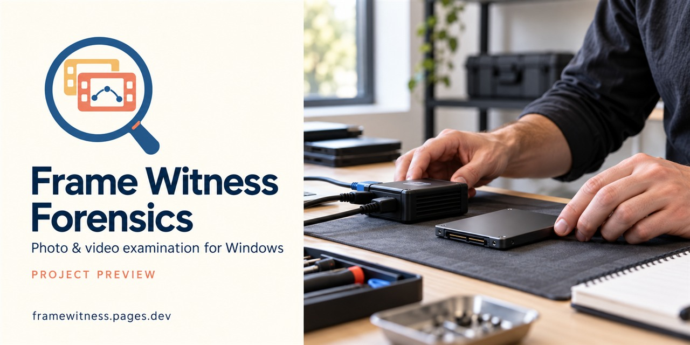
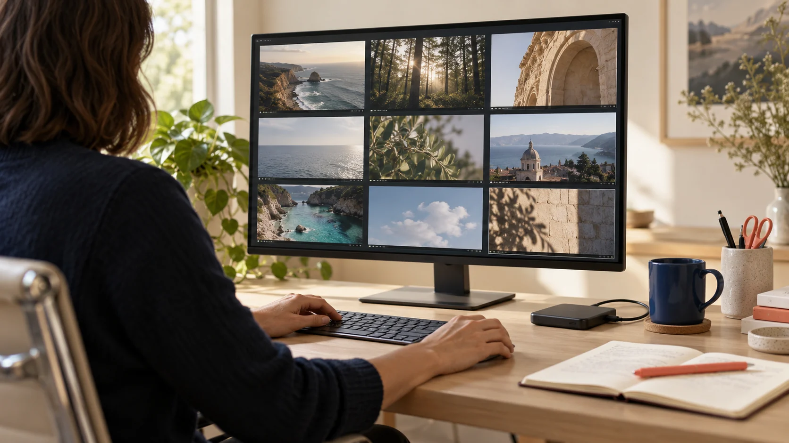

# Frame Witness

**Photo and video recovery for Windows. Visual review with source context.**

Examine recoverable media on physical SSDs, hard drives and supported disk images.
Move from a file candidate to a visual review, then inspect its source offsets,
SHA-256 hash and available dates without leaving the examination workflow.

**Pre-release** · Windows desktop · Local media analysis · Proprietary software

[Explore the product](https://framewitness.pages.dev/#product) ·
[Examination workflow](#examination-workflow) ·
[Release status](#release-status) ·
[Useful links](#useful-links)

---

## See the media. Keep the context.

Frame Witness is focused on photo and video examination. Its development
workflow combines visual triage with the technical details needed to assess a
finding. A playable frame is an observation; it does not prove that the complete
original survived.

| Examination task | What the workflow provides |
| :--- | :--- |
| **Review candidates visually** | A media gallery, local previews and playback, with sorting by size or available date. |
| **Search surviving content** | Filesystem records and RAW media structures, including supported remnants when current metadata is absent. |
| **Retain source context** | Recorded offsets, SHA-256 hashes and available filesystem information alongside the media. |
| **Read dates with their source** | Filesystem, container and surviving Recycle Bin dates are distinguished; missing dates remain unknown. |
| **Assess recovery quality** | Structural recognition, a decoded frame and complete-file verification remain separate checks. |
| **Keep media local** | Examination runs on the Windows workstation. Scanner and decoder workers use AppContainer isolation. |

*Cover and laboratory scene are AI-generated illustrations. They are not
product screenshots, customer evidence or measured recovery results.*

## Examination workflow

1. **Choose and preserve the source.** Select a supported image or physical disk.
   Prefer an acquired image and a write blocker where appropriate; Windows keeps
   changing a live system disk even when the application only reads it.
2. **Search what remains.** Examine filesystem records and recognizable media
   structures. A metadata filter can exclude items whose metadata did not survive.
3. **Review and verify.** Inspect candidates in the gallery and player, then
   compare their source details, dates and structural findings.
4. **Export with context.** Use a different physical destination for recovered
   media to avoid overwriting potential remnants on the source.

## Useful links

| Destination | What you will find |
| :--- | :--- |
| [Official website](https://framewitness.pages.dev) | Product overview and current availability. |
| [Features and illustrative demo](https://framewitness.pages.dev/#product) | Visual review, source context and local examination. |
| [Workflow and recovery limits](https://framewitness.pages.dev/#workflow) | Source preservation, search, examination and export. |
| [Plans and indicative pricing](https://framewitness.pages.dev/#pricing) | Planned offers; purchases are not open. |
| [Account and licences](https://framewitness.pages.dev/account.html) | Email-code sign-in and the licence portal. |
| [Frequently asked questions](https://framewitness.pages.dev/#questions) | Deleted files, earlier formats, Tor clues, dates and device scope. |
| [Release channel](https://github.com/AurelioAvila/frame-witness/releases) | Future signed installers and checksums; no release is published yet. |
| [Legal information](https://framewitness.pages.dev/legal.html) | Current product and commercial status. |

## Release status

**Public downloads and purchases are not open.** This repository is the
designated distribution channel for future publisher-signed installers and
their SHA-256 checksums. Email-code access to the account portal is available;
the homepage evaluation-registration form is not active. Planned prices are
not live offers.

The application source is maintained separately in a private repository.
This public presentation does not grant an open-source licence to the product.
Before operational use, evaluate the eventual release against representative
sources and your organization's requirements.

Future downloads will identify the signed installer and its checksum. Verify
the final artifact before installation. Signing establishes publisher identity
and integrity when verified; it does not guarantee the absence of vulnerabilities
or Windows reputation warnings.

## What recovery can establish

- **Deletion and earlier formats:** recovery depends on accessible surviving
  bytes, fragmentation and supported structures. Overwritten or TRIM-erased
  data cannot be promised.
- **Tor and .onion clues:** available metadata or acquired residues may provide
  leads. An onion reference is not proof that Tor downloaded a video; absent
  artifacts do not rule out browser use.
- **Dates:** recorded timestamps are source values, not proof of recording time
  or a complete deletion history.
- **Isolation:** AppContainer reduces exposure while processing untrusted
  data; it is not an absolute security guarantee.
- **Professional suitability:** no police certification, institutional
  endorsement or superiority over competing tools is claimed.

---

**Focused on:** digital media forensics · photo and video recovery · file carving ·
disk-image examination · Windows storage analysis · visual triage · verification

[Visit Frame Witness](https://framewitness.pages.dev) ·
[Copyright and third-party rights](COPYRIGHT.txt)
